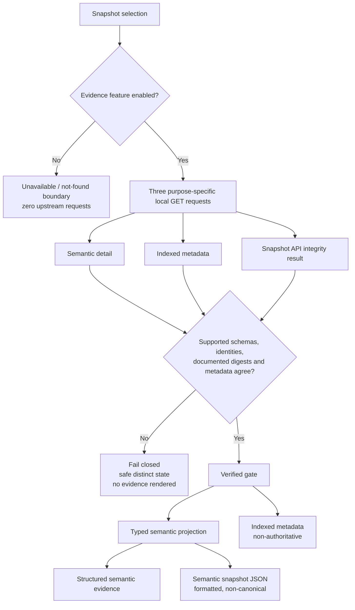

# Evidence Browser pre-operational guide

This guide documents the locally hardened Phase 17F reader path. It does not
claim deployment or production certification.

## Request and authority flow

The Snapshot API performs integrity verification. The BFF and browser only
validate and enforce its result. They do not calculate digests, canonicalize
evidence, or regenerate canonical bytes.

## Operational configuration

All configuration is server-only. No Evidence Browser setting may use a
`NEXT_PUBLIC_` prefix.

| Variable | Requirement | Safe failure |
| --- | --- | --- |
| `EVIDENCE_BROWSER_ENABLED` | Literal `true` enables the reader surface; every other value disables it | Evidence pages and BFF routes fail closed with zero upstream traffic |
| `SNAPSHOT_API_INTERNAL_URL` | Absolute `http` or `https` origin, at most 2,048 characters; no user info, path, query, or fragment | Sanitized configuration-unavailable response |
| `SNAPSHOT_READER_API_TOKEN` | Server-held printable ASCII bearer token, 16–4,096 characters, no spaces or controls | Sanitized configuration-unavailable response |

There are no default live hosts, fallback credentials, or client-provided
upstream headers. The BFF emits only `Accept`, its server-held reader
authorization, and the validated/generated correlation ID.

### Reader routes and policies

| Local BFF route | Upstream timeout | Maximum response |
| --- | ---: | ---: |
| `GET /api/evidence/snapshots` | 3 seconds | 512 KiB |
| `GET /api/evidence/snapshots/{snapshotId}` | 5 seconds | 5 MiB |
| `GET /api/evidence/snapshots/{snapshotId}/metadata` | 3 seconds | 256 KiB |
| `GET /api/evidence/snapshots/{snapshotId}/integrity` | 3 seconds | 64 KiB |

Browser-side parsing applies the same limits to local BFF responses. Semantic
projection additionally limits nesting depth to 12, one array to 500 items, one
string to 20,000 characters, traversal to 5,000 nodes, and formatted semantic
JSON to 512 KiB.

Every request is `GET`, `no-store`, purpose-specific, same-origin, and
cancelled when superseded or unmounted. Upstream redirects are rejected.
Unsupported content types, malformed UTF-8/JSON, oversized payloads,
success/error hybrids, unexpected fields where exact shape is required, and
unsupported schemas fail closed.

### Retry and correlation policy

There are no automatic retries. Operators may explicitly retry or refresh.
Doing so immediately clears previously displayed evidence. Integrity failure,
metadata disagreement, malformed response, unauthorized, forbidden, not found,
and unsupported schema never retry automatically.

`X-Correlation-ID` accepts only 1–128 characters from
`A-Z`, `a-z`, `0-9`, `.`, `_`, `:`, and `-`. Invalid or absent values are
replaced with a synthetic server-generated UUID. Correlation IDs may be used for
operational tracing; snapshot IDs, evidence, full digests, tokens, cookies,
authorization headers, upstream bodies, and private hosts must not be logged or
used as metric labels.

## Safe failure expectations

- Missing, disabled, malformed, or incomplete configuration produces no
  upstream request.
- Timeout remains distinct from generic unavailability.
- Caller cancellation aborts the in-flight upstream request and cleans up its
  timeout and listener.
- Error responses contain only fixed `ok: false`, the BFF code, and a safe
  correlation ID.
- No error body, exception, private host, credential, cookie, or raw evidence is
  returned to the browser.
- Any non-verified integrity state suppresses indexed metadata, structured
  evidence, and semantic JSON.

## Phase 17F-5B certification checklist

**Not yet certified. Requires Phase 17E Operational GO.**

- [ ] Confirm operator authentication equivalence in the isolated private
  environment.
- [ ] Confirm private-network reachability without a public Snapshot API route.
- [ ] Compare every live reader response with the frozen transport contract.
- [ ] Confirm configured timeout behavior and cancellation under real latency.
- [ ] Confirm sanitized error-envelope and correlation-header conformance.
- [ ] Confirm unsupported-schema behavior remains distinct.
- [ ] Confirm integrity failure suppresses all evidence.
- [ ] Confirm metadata disagreement suppresses all evidence.
- [ ] Confirm detail, metadata, integrity, and list response-size rejection.
- [ ] Inspect logs and metrics for evidence, identifiers, digests, credentials,
  cookies, headers, upstream bodies, and high-cardinality leaks.
- [ ] Run repository and deployment-artifact secret scans.
- [ ] Run keyboard, focus, screen-reader, responsive, and unavailable-state
  accessibility smoke tests.
- [ ] Produce and verify the production build from the reviewed revision.
- [ ] Rehearse disabling the feature flag as the rollback.
- [ ] Verify rollback produces zero Snapshot API traffic and does not affect
  TraderNow.
- [ ] Record certification evidence and obtain the explicit 17F-5B release gate.
