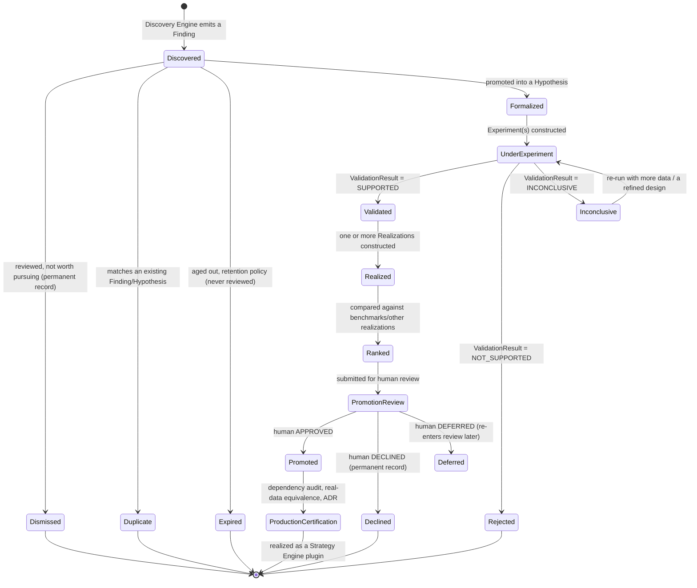
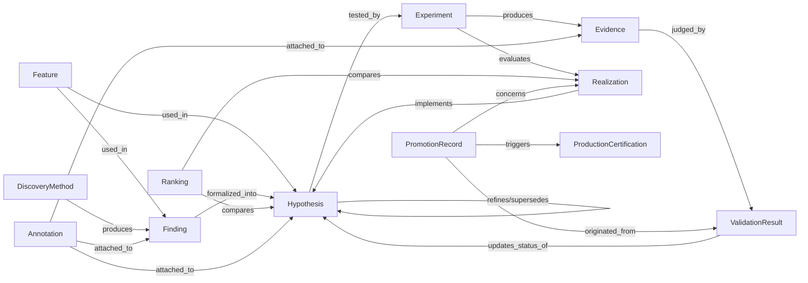
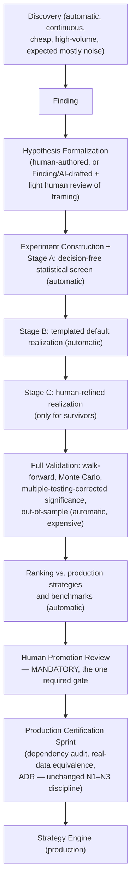

# Phase N4 Master Architectural Blueprint — The Research Engine

**Status:** Blueprint (pre-implementation) — the single architectural reference for Phase N4
**Date:** 2026-07-21
**Scope:** `live/atlas/research/` and its subpackages, in relation to the certified N1–N3 pipeline

> This is not an ADR and not an implementation plan. It is the durable design
> reference every future Research Engine sprint should realize, not
> re-litigate. It assumes the platform, and this document, will be read and
> extended for years.

---

## 0. Foundation: what this builds on, and what it never touches

```
Market Engine → Rule Engine → Setup Engine → Setup Interpretation → Replay Engine → Strategy Engine
```

All six are production-certified (ADR-0001, ADR-0002, ADR-0003, Phase N3 Sprint 7 certification). **None of them are redesigned, modified, or reinterpreted by anything in this document.** The Research Engine is an additive, one-way downstream consumer — of `MarketState`, `RuleEngineOutput`, `SetupEngineOutput`, `SetupInterpretation`, and `ReplayFrame` — exactly as Setup Interpretation and Strategy Engine are consumers of what sits above them. Everything below builds *on top of*, never *into*, the certified chain.

**Core philosophy, stated once, load-bearing everywhere below:** research is not centered on strategies. It is centered on **hypotheses** — falsifiable claims about the market. A strategy is one possible downstream *consequence* of a validated hypothesis, never the unit the system organizes itself around. The platform's product is accumulated, queryable knowledge — including permanently-recorded negative results — not a leaderboard of trading rules.

---

## 1. Entities

Ten entities are needed. Two candidate names from the brief (`Experiment Result` and `Evidence`) describe one concept and are merged; `Research Memory` and `Knowledge Base` are not persisted entities but query capabilities over the other ten (justified in §4–5). `Versioning` is not an entity either — it is a cross-cutting discipline (a `schema_version` plus a content fingerprint) applied uniformly to every entity below, the same two-layer pattern already used for `context_fingerprint` and `interpretation_fingerprint` in N1–N3.

| Entity | What it is | Why it must exist as its own type |
|---|---|---|
| **Feature** | A named, versioned computation over `MarketState`/`ReplayFrame`-derived data. Two tiers: **Registered** (reviewed, permanent, code-defined — the research-only analogue of Rule Engine's own `FactRegistration`) and **Candidate** (declarative, auto-generatable, ephemeral until promoted). | Ingredients for everything downstream; must be able to exist experimentally without ever touching Rule Engine's frozen registry. |
| **Finding** | Discovery Engine's raw output: a statistical pattern or relationship observed in the data, tagged with the discovery method and dataset that produced it. Not yet a claim; not yet falsifiable; expected to be numerous and mostly not worth pursuing. | The essential "detected, not yet interpreted" layer — mirrors `FactResult` vs. `SetupResult` vs. `SetupInterpretation`'s own detected/interpreted split, one level up. Without this layer, Discovery would either be too timid to explore or would pollute the hypothesis ledger with noise. |
| **Hypothesis** | A structured, falsifiable claim: *this condition/feature-combination, under this context, is associated with this measurable outcome, at this effect size, with this confidence.* Generalizes Sprint 28's existing `Hypothesis`/`AcceptanceCriterion` beyond firing-rate-only criteria. | **The central entity.** See §7 for the full defense of why. |
| **Realization** | An executable or structural expression of a hypothesis. Subtypes: `StatisticalTestRealization` (no decisions — cheapest), `TemplatedStrategyRealization` (auto-generated default rule), `StrategyVariantRealization` (human-authored, parametrized — the only subtype that resembles the previous proposal's `StrategyVariant`), `ContextFilterRealization` (feeds a gating condition), `RiskInputRealization` (feeds sizing/risk logic). | A hypothesis may have zero, one, or several competing realizations. Forcing every hypothesis to be "a strategy" would discard purely descriptive findings and filter/risk-only findings, which are common and valuable. |
| **Experiment** | A fully-specified, immutable, fingerprinted, runnable configuration: `hypothesis_ref` + optional `realization_ref` + one or more `DatasetManifest`s (plural, for walk-forward folds) + `EvaluationMode` (single / walk-forward / Monte Carlo) + `code_version` + `seed` (if stochastic). | The disposable unit of computation. Reproducibility requires it be immutable and fingerprinted (hypothesis + realization + dataset + spec → deterministic fingerprint), the same guarantee already used for `SETUP_INTERPRETATION_V1`. |
| **Evidence** *(merges "Experiment Result" and "Evidence")* | The raw, structured output of a completed Experiment: computed metrics, decision sequences (if any), confidence intervals, effect sizes — computed, not yet judged. | These two candidate names describe the same object; keeping both would create a redundant near-duplicate type. "Evidence" is the correct name because it emphasizes *this is an input to a judgment*, not the judgment itself. |
| **ValidationResult** | The judgment layer: applies a hypothesis's acceptance criteria, multiple-testing correction, and walk-forward/out-of-sample consistency checks to one or more `Evidence` records, producing a verdict (`SUPPORTED` / `NOT_SUPPORTED` / `INCONCLUSIVE`) with full statistical justification attached — never a bare boolean. | Separating this from `Evidence` is what keeps "we computed a number" distinct from "we decided what the number means" — the same computed/interpreted split repeated a third time at this layer. A hypothesis can accumulate *multiple* `ValidationResult`s over its life (e.g., re-validated later against fresh data); this is a first-class, permanent history, not a one-shot event. |
| **Ranking / ComparativeAssessment** | A derived, recomputable comparison of hypotheses/realizations against each other and against benchmarks (existing production strategies, naive baselines, random). A **Leaderboard Snapshot** (versioned, timestamped) is the one part worth persisting, for "what did we believe was best at time T" queries. | Mostly a view over `Evidence`/`ValidationResult`, not a new independent fact — but history of past rankings has its own value and must be snapshotted, not only computed on demand. |
| **PromotionRecord** | The permanent record of a human decision to promote, decline, or defer a hypothesis/realization toward production. Carries a mandatory rationale, a pinned snapshot of the evidence reviewed, and (once acted on) a link to the resulting production change. | The one place a human decision becomes a permanent, auditable fact. A `DECLINED` promotion is exactly as valuable a record as an `APPROVED` one — it prevents re-reviewing the same rejected idea. |

**Why `Research Memory` and `Knowledge Base` are not entities:** they are described fully in §4–5. In short — Research Memory is the *property* that emerges once the above nine entities are append-only and cross-referenced; Knowledge Base is a *query projection* over that same data. Modeling either as its own persisted entity would create a duplicate, driftable copy of facts that already live on the entities themselves.

---

## 2. Lifecycles

### 2.1 The end-to-end entity lifecycle (the pipeline the brief asked for)



Every terminal state on the left half of this diagram (`Rejected`, `Declined`, `Dismissed`, `Duplicate`, `Expired`) is **permanent, not deleted** — this is the whole point of Research Memory (§4). Only `Expired` Findings are ever pruned, and only Findings — never a formalized Hypothesis, its Evidence, its ValidationResults, or any PromotionRecord.

### 2.2 Per-entity state tables

**Feature**
| State | Meaning | Next states |
|---|---|---|
| `PROPOSED` | A candidate feature spec exists (declarative, or output of representation learning) | `EVALUATED`, `ARCHIVED` |
| `EVALUATED` | Assessed by Discovery/Statistics for usefulness | `PROMOTED`, `ARCHIVED` |
| `PROMOTED` | Became a Registered feature (reviewed, code-defined, permanent) | `SUPERSEDED` |
| `ARCHIVED` | Not useful enough; kept for record | *(terminal)* |
| `SUPERSEDED` | A newer version of the same concept replaces it | *(terminal, linked forward)* |

**Finding** — see §2.1 (`Discovered → Dismissed / Duplicate / Expired / Formalized`).

**Hypothesis**
| State | Meaning | Next states |
|---|---|---|
| `PROPOSED` | Drafted (by human, Discovery formalization, or AI) but not yet fully specified | `REGISTERED`, `WITHDRAWN` |
| `REGISTERED` | Falsifiable claim + acceptance criteria + dataset manifest fully specified | `UNDER_EXPERIMENT` |
| `UNDER_EXPERIMENT` | One or more Experiments constructed/running | `VALIDATED`, `REJECTED`, `INCONCLUSIVE` |
| `INCONCLUSIVE` | Insufficient evidence either way | `UNDER_EXPERIMENT` (re-tested later) |
| `VALIDATED` | Passed acceptance criteria with required rigor (holdout + multiple-testing correction) | `REALIZED`, `SUPERSEDED` |
| `REJECTED` | Failed acceptance criteria | *(terminal, permanent)* |
| `REALIZED` | ≥1 Realization exists | `PROMOTION_CANDIDATE` |
| `PROMOTION_CANDIDATE` | Submitted for human review | `PROMOTED`, `DECLINED` |
| `PROMOTED` | Approved for production certification | *(terminal — ownership passes to the production certification process)* |
| `DECLINED` | Human said no | *(terminal, permanent)* |
| `SUPERSEDED` | A refined/child hypothesis replaces this one | *(terminal, linked forward via lineage)* |
| `WITHDRAWN` | Withdrawn before registration (e.g., duplicate found) | *(terminal)* |

**Realization**
| State | Meaning |
|---|---|
| `DRAFTED` | Specified, not yet run |
| `CONSTRUCTED` | Bound into a runnable Experiment |
| `EVALUATED` | Ran, has Evidence |
| `RETAINED` | Kept as the current best realization of its hypothesis |
| `DISCARDED` | Didn't help despite a validated hypothesis (a real, useful outcome) |
| `PROMOTED` | Selected for production certification |

**Experiment** — `CONSTRUCTED → RUNNING → COMPLETED | FAILED`. `FAILED` (an execution error) is explicitly distinct from a negative finding — it means the experiment didn't run cleanly, not that the hypothesis was disproven.

**Evidence** — `COMPUTED` → consumed by one or more `ValidationResult`s. Has no pass/fail state of its own by design (§1).

**ValidationResult** — append-only; no transitions, only accumulation. A Hypothesis's own state is *derived from* (or explicitly updated in response to) its history of `ValidationResult`s, never overwritten.

**PromotionRecord** — `PENDING_REVIEW → APPROVED | DECLINED | DEFERRED`; `DEFERRED` can re-enter `PENDING_REVIEW` later, always with a new record (never edited in place).

---

## 3. Relationships — the conceptual graph



Plain-language edge list (the explicit triples the brief asked for):

- `Finding` — `formalized_into` → `Hypothesis`
- `Finding` — `generated_by` → `DiscoveryMethod` (versioned: which method, which run, which parameters)
- `Hypothesis` — `tested_by` → `Experiment`
- `Hypothesis` — `refines` / `supersedes` → `Hypothesis` (lineage, never a destructive replace)
- `Experiment` — `produces` → `Evidence`
- `Evidence` — `judged_by` → `ValidationResult`
- `Realization` — `implements` → `Hypothesis`
- `PromotionRecord` — `originated_from` → `ValidationResult`
- `PromotionRecord` — `concerns` → `Realization`
- `Strategy (production)` — `promoted_from` → `Realization` (the one edge that ever crosses into Strategy Engine's territory, and it is a **record**, not a live dependency — Strategy Engine never imports anything from Research Engine)

---

## 4. Research Memory

Research Memory is **not a stored entity** — it is the property that emerges once Findings, Hypotheses, Experiments, Evidence, ValidationResults, and PromotionRecords are (a) append-only, (b) fully cross-referenced via the edges in §3, and (c) queryable as a whole rather than only individually. Modeling it as its own entity would just create an eleventh type holding a copy of facts the other ten already own — a duplication risk, not a feature.

What Research Memory must *do*, concretely:

1. **Never forget.** Every terminal state in §2.1 — including `REJECTED`, `DECLINED`, `DISMISSED`, `DUPLICATE` — is a permanent row, never deleted, never overwritten. The only entity ever pruned is an *unformalized* `Finding` past its retention window (§6); once a Finding becomes a Hypothesis, or once any Evidence/ValidationResult/PromotionRecord exists, nothing about it is ever removed.
2. **Answer "have we tried this?" without reading old reports.** This requires a standing **similarity/duplicate-detection capability**, not just an ID lookup: given a proposed hypothesis statement (feature combination + context + outcome metric), return the N most structurally similar existing Hypotheses — including rejected ones — before a new one is formalized. This is the single capability that makes negative results actually prevent wasted re-work, rather than merely being stored inertly.
3. **Preserve provenance forever, per version** (detailed in §7) so "who/what proposed this, and who refined it" is always reconstructable.
4. **Support meta-research.** Because rejection is permanent and structured (not a deleted row), the platform can eventually answer questions like "which category of hypotheses tends to fail?" or "has our hit rate on ICT-derived findings changed over time?" — a capability that only exists because nothing was thrown away.

A **Research Notebook** — free-form, searchable, but explicitly non-authoritative annotations attached to any entity (§3's `Annotation` node) — is the deliberate escape hatch for commentary that doesn't belong in a structured field. Annotations are never read by any acceptance criterion or validation logic; they exist for humans and the AI assistant to leave and later retrieve context, nothing more.

---

## 5. Knowledge Base — graph projection, not a new store

Should there be an explicit knowledge graph? **Yes, as a read-only, derived, rebuildable *query projection* over the canonical ledger — not as the canonical storage model itself.**

**Why not store the canonical data as a graph directly:** Research Engine also needs heavy aggregate/statistical queries (effect-size distributions, significance thresholds, leaderboard rankings) — these are naturally relational/columnar problems, and graph databases are comparatively weak at them. Committing the *primary* store to a graph model this early would also be a premature technology choice, the same anti-pattern this project has repeatedly and deliberately avoided (Postgres deferred for the exact same reason in N1–N3's own research stores).

**Why a graph projection is still valuable:** the relationships in §3 are exactly the shape graph traversal is good at and relational joins are awkward at — "find every hypothesis that shares two or more features with hypothesis X," "find the shortest evidentiary chain from Finding F to a promoted strategy," "show me everything downstream of this rejected hypothesis." These are multi-hop, variable-depth, relationship-centric questions. Relational modeling handles them through an increasing pile of joins that gets worse as the schema grows; a graph-shaped read view handles them natively.

**Recommendation:** keep the canonical ledger relational/append-only (same file-backed-now, Postgres-later posture as the rest of Research Engine), and expose a **derived, rebuildable graph projection** — computed *from* the canonical data, never a second source of truth — for exploratory research queries and as the AI assistant's primary read interface. If the canonical store is ever corrupted or needs migrating, the graph projection is simply rebuilt from it; it never needs its own backup/recovery story.

**Trade-off accepted:** maintaining a projection is a second read-path to keep in sync (even if mechanically, not manually) — worth it because the alternative (forcing every exploratory query through relational joins, or forcing the canonical store to be a graph database prematurely) is worse in both directions.

---

## 6. Discovery Engine, expanded

Discovery Engine (`atlas.research.discovery`) is a family of independently versioned methods, each producing `Finding` records tagged with its own method name, version, and parameters — never modifying the Feature registry's registered tier directly, only ever producing candidates or findings for a human/formalization step to act on.

| Method family | What it looks for | Architectural placement / notes |
|---|---|---|
| **Correlation / interaction discovery** | Pairwise and N-way relationships between features and outcomes | Generalizes RE-1's existing pairwise lift/correlation methodology beyond registered Rule Engine facts to arbitrary candidate features. |
| **Clustering** | Groupings of bars/episodes/feature-vectors with shared structure | Feeds regime discovery (below) and candidate feature generation. |
| **Anomaly detection** | Bars/episodes that don't fit any known cluster or pattern | Findings here are explicitly framed as "unusual, not yet explained" — good raw material for the AI assistant's explanatory role (§7), not a claim on its own. |
| **Causal discovery** | Temporal-precedence / intervention-style evidence, not mere co-occurrence | Deliberately a **stronger, rarer claim category** — every Finding from this family carries a `claim_strength: causal` tag, distinct from `associative`, and Hypothesis Formalization must never silently conflate the two. Causal claims should face a higher formalization bar (more evidence required) before becoming a `Hypothesis`. |
| **Temporal pattern / sequence mining** | Recurring *ordered* sequences of feature-states or setup activations over time (e.g., "sweep tends to precede displacement within 3 bars in a compressed regime") | Naturally consumes RE-2's own `SetupEpisode`/`ActivationEvent` structures as raw material — reuse, not reinvention. |
| **Regime discovery** | New candidate market-state segmentations (e.g., clustering-derived) | Produces **Candidate Regime Definitions** — research-only context dimensions a hypothesis can condition on. Never replaces, edits, or is confused with Market Context's frozen, certified `VolatilityRegime`. |
| **Feature importance** | Which features/combinations most explain a target outcome | Output feeds both Hypothesis Formalization directly and *back into* candidate feature generation — a deliberate feedback loop (importance analysis tells the platform where to look harder). |
| **Representation learning** | Learned/embedded feature representations that capture structure no hand-designed feature does | The one method family requiring explicit extra caution: any representation-learned feature must carry a mandatory `interpretability_status` and a higher human-review bar before it may participate in a Hypothesis at all. A "black box that works" conflicts with this platform's actual purpose — accumulating *understood* knowledge, not just working buttons — so this is a deliberate, disclosed tension, not a solved problem: the capability is allowed to exist, but it is not allowed to graduate to production without disproportionate scrutiny. |

Every method above lives in its own submodule, is independently versioned, and can be added, improved, or retired without touching any other method or any earlier Finding's own record of which version produced it.

---

## 7. AI Research Assistant, expanded

`atlas.research.assistant` is an advisory layer beside the pipeline — never inside its validated path, never able to execute anything, never able to make or influence a trading decision.

**Can read:** every Finding, every Hypothesis (all statuses, explicitly including rejected and declined ones — an assistant that can't see dead ends will keep proposing them), every Evidence, ValidationResult, Ranking/leaderboard snapshot, PromotionRecord, both Feature tiers, and the full Knowledge Base graph projection (§5).

**Can write, and only ever as drafts:**
- Draft `Hypothesis` proposals — always created in state `PROPOSED`, never `REGISTERED` or beyond; they enter the identical formalization → construction → validation → ranking pipeline as anything else, no shortcut.
- Draft `Experiment` specs — constructed the same way a human-authored one would be, never auto-run outside the standard queue.
- **Annotations** — natural-language commentary attached to any existing entity (an explanation, a flagged anomaly, a suggested direction). Annotations are metadata, never a field consulted by any acceptance criterion or validation logic.

**Can never:**
- Mark a Hypothesis `VALIDATED`, `REJECTED`, or otherwise change its formal status.
- Create or approve a `PromotionRecord`.
- Write to the Feature registry's registered tier.
- Execute anything against Replay Engine or Strategy Engine directly — it must go through the same Experiment construction/queue path as a human.
- Edit any existing, already-persisted entity — append-only applies to AI-authored content identically; the assistant only ever adds new records, never alters history.
- Participate in, or influence, any actual trading decision, in any form.

**Provenance, and how AI-generated ideas remain distinguishable forever:** every entity carries an immutable `provenance` field (`human` / `discovery_engine` / `ai_assistant`) fixed at creation and never mutated. Critically, provenance is tracked **per version, not once at the root**: if a human refines an AI-proposed Hypothesis into a new registered version, that new version records its *own* provenance (`human`) plus a `derived_from` pointer back to the AI-originated ancestor. The full chain — "AI proposed X, a human refined it into Y, Y was validated" — remains reconstructable indefinitely; it is never collapsed into a single ambiguous "who gets credit" flag. An AI's explanation of *why* a pattern exists is itself just a claim, and is free to become a new Hypothesis in its own right (a hypothesis about another hypothesis) — a clean, self-similar way for the architecture to absorb AI-assisted meta-research without a special case.

---

## 8. Promotion pipeline



Every stage before the human review is optional acceleration — a human with a strong idea can go straight to Stage C, skipping Discovery entirely — but **nothing reaches production without the mandatory human review, and nothing reaches the human review without having passed through the identical statistical rigor regardless of whether a human, Discovery Engine, or the AI assistant originated it.** The Production Certification Sprint itself is unchanged from what N1–N3 already established: a dependency audit, a real-data equivalence study, and an ADR — Research Engine does not get to skip or lighten that step for anything it produces.

---

## 9. Package architecture

| Package | Responsibility | Depends on | Notes |
|---|---|---|---|
| `atlas.research` (top-level, existing) | `Hypothesis`, `Finding`, `Experiment`, `Evidence`, `ValidationResult`, `Realization`, `PromotionRecord`, `DatasetManifest`, `AcceptanceCriterion` — generalized from Sprint 28's MVP; `stores.py` (append-only registries, Protocol-bound); `serialization.py` | Market Engine, Rule Engine, Setup Engine, `atlas.profiling` | Core ledger. Existing behavior preserved; model generalized, not replaced. |
| `atlas.research.statistical_profiling` (RE-1) | Fact-level statistical characterization | Rule Engine | **Untouched.** |
| `atlas.research.setup_profiling` (RE-2) | Episode-level setup characterization | Rule Engine, Setup Engine | **Untouched.** |
| `atlas.research.features` | Registered (code, reviewed) + Candidate (declarative spec + fixed evaluator) feature tiers | Market Engine, Rule Engine models | Mirrors Rule Engine's own registry shape; never imported by it. |
| `atlas.research.discovery` | Discovery Engine: correlation, clustering, anomaly, causal, sequence, regime, importance, interaction, representation submodules | Features, `atlas.profiling`, RE-1/RE-2 outputs | Produces `Finding` only — never a `Hypothesis` directly. |
| `atlas.research.formalization` | Turns a Finding (or human/AI draft) into a registered Hypothesis; owns duplicate/similarity detection | `atlas.research` core, Knowledge Base projection | The Discovery/Hypothesis boundary. |
| `atlas.research.experiment_builder` | Hypothesis + Realization kind + validation spec → Experiment | `atlas.research` core | Owns the Stage A/B/C funnel construction logic. |
| `atlas.research.replay_bridge` | The **one** gateway to `atlas.replay_engine` | Replay Engine (models + service) | No other Research Engine module imports Replay Engine. |
| `atlas.research.backtesting` | Pure execution: Realization × ReplayFrame sequence → decision sequence | replay_bridge output, `atlas.research` core | Computes zero statistics. |
| `atlas.research.statistics` | Criterion/metric evaluation → `Evidence` | `atlas.research` core | Computes zero decisions. |
| `atlas.research.validation` | Walk-forward, Monte Carlo, out-of-sample, benchmark orchestration → `ValidationResult` | statistics, backtesting | Deterministic given an explicit seed. |
| `atlas.research.ranking` | Comparative assessment + leaderboard snapshots | validation outputs | Mostly a view; snapshots persisted. |
| `atlas.research.memory` | Research Memory query layer: similarity search, "have we tried this," retention/expiry enforcement for Findings | `atlas.research` core | See §4. |
| `atlas.research.knowledge_graph` | Read-only, derived, rebuildable graph projection over the canonical ledger | `atlas.research` core | See §5. Never a second source of truth. |
| `atlas.research.assistant` | AI Research Assistant — reads broadly, writes only drafts/annotations | `atlas.research` core, Knowledge Base, **and an isolated AI/LLM service client** | The **only** package in this list, and one of very few in the entire `atlas` tree, permitted to depend on an LLM service. |
| `atlas.research.promotion` | `PromotionRecord` entity and the human review workflow representation | `atlas.research` core | Does *not* perform the production certification sprint itself — that remains a separate, cross-package, human-led effort. |
| `atlas.research_export` / `atlas.live_view` (existing) | Frozen/live export surfaces for the dashboard | RE-1/RE-2 outputs | **Untouched.** A future leaderboard/knowledge-base snapshot export is a plausible extension, explicitly deferred. |
| `atlas.profiling` (existing) | Shared pure primitives (`segment_by_gap`, `filter_input_states`) | Market Engine | **Untouched**, reused. |

**Dependency boundaries (enforced by the same AST-based audit pattern used for every layer in N1–N3):**
- Research Engine (all subpackages) may depend on Market Engine, Rule Engine, Setup Engine, Setup Interpretation, Market Context, Replay Engine (models + service, via `replay_bridge` only), `atlas.profiling`, `atlas.core`.
- Research Engine may **never** depend on `atlas.strategy_engine`, `atlas.api`, `atlas.events`, execution/paper-trading/live-trading packages, or any repository writer used for live ingestion.
- **`atlas.research.assistant` is the sole, explicitly disclosed exception**: it alone may depend on an AI/LLM service client, walled off from every other Research Engine package.
- **Nothing outside `atlas.research` may ever import it** — zero production dependents, verified the same way Replay Engine's and Setup Interpretation's zero/approved-dependent lists are verified today.
- **The Research Engine has no conceptual dependency on PostgreSQL.** No `atlas.research*` package imports `atlas.db` or any repository writer (covered by the same dependency-boundary audit as above). The Research Ledger's own persistence (`atlas.research.stores`, backed by `atlas.research_deploy.startup_check`'s `LedgerStores`) is JSONL-file-based and entirely independent of the trading database. The current Railway deployment's hard requirement on `DATABASE_URL` (`atlas.main`'s `create_pool()` refusing to start without it) is a property of *today's single-process backend architecture* — the Research Engine and the trading backend deploy as one Uvicorn process — not a property of the Research Engine itself. A future split of Research into its own deployable service should not inherit this coupling by default; treat the current requirement as deployment-topology debt, not an architectural constraint.

**Future extension points:** new Discovery methods, new `CriterionKind`s, new `Realization` kinds, new validation/resampling schemes, and new Knowledge Base query capabilities are all additive submodules — none require touching an existing entity's meaning or any earlier recorded fact. A future "does hypothesis A interfere with hypothesis B" (portfolio-level, multi-hypothesis interaction) question is out of scope today, but the relationship graph in §3 already has room for it without a schema change.

---

## 10. Research philosophy — why this is not a backtesting framework

A traditional backtesting framework's unit of work is *"run this rule against this history and report a number."* Its data model rewards whatever ran fastest and scored best; a rule that didn't work simply isn't kept, because there was never anywhere to keep it. That shape is optimized for grading ideas someone already had — which is exactly the center of gravity this document rejects.

This platform's unit of work is *"accumulate a falsifiable, permanent, queryable claim about the market."* A validated strategy is one possible, optional consequence of that work — not the reason the work exists. Four design choices follow directly from that difference, and are the actual substance of "fundamentally different," not just branding:

1. **Rejection is a first-class, permanent, useful outcome**, not a discarded run. A `REJECTED` Hypothesis or `DECLINED` promotion is exactly as valuable a database row as a validated one, because it is what stops the same dead idea from being re-tested every few months.
2. **Discovery is structurally separated from validation.** Because a `Finding` is not a `Hypothesis`, the mining layer is free to be loose, cheap, and wrong most of the time — which is what real exploration requires — without ever letting an unvalidated statistical artifact masquerade as tested knowledge.
3. **Provenance is permanent and per-version**, not a label that fades. Five years from now, it will still be possible to say precisely which idea a human had, which a script mined, and which an AI proposed — and to trace exactly how one became another.
4. **Production promotion is a rare, deliberate, human-gated event**, never the default assumption of what the system is for. The platform's success is measured by the knowledge it has accumulated — including everything it has ruled out — not by how many strategies it has shipped.

This is a knowledge-accumulation system with a backtesting engine inside it, not a backtesting engine with a research veneer on top of it.
